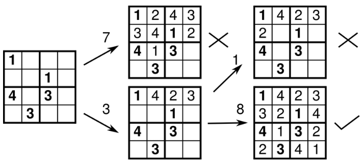

# Sudoku solver: Backtracking algorithm

The backtracking algorithm is a very simple algorithm to be used as a sudoku solver.
It iterates over the following steps:

1. **An empty space is found**. It does not matter if the algorithm iterates over columns and then over rows, vice-versa or takes a random coordinate to find an empty space. The goal is to start with an emtpy space.
2. **A guess is made**. The guess is just any number which is not contained in the row, column or major tile. This guess is only a valid number to be positioned at the current tile, but it doesn't have to be the correct one.
3. **Continue** iterating steps 1 and 2. With this, the tree continues expanding, creating new branches every time a new guess is made in a tile where multiple valid numbers can be used as a guess.
4. **Go back** to the last created branch if the puzzle reach a tile in which no valid guesses can be done.
5. **Iterate until a solution is found**.

